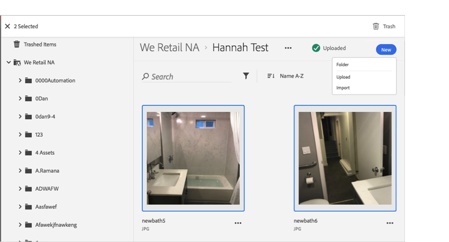

# Een middel naar prullenmand verplaatsen{#trash-an-asset}

U kunt middelen in de Adobe Experience Cloud Library als afval uit de bibliotheek verwijderen.

Een middel in de Experience Cloud Library als afval opslaan:

1. Klik op een of meer elementen om de prullenbak te sluiten. 

1. Klik op het **[!UICONTROL Trash]** pictogram boven aan de pagina.

