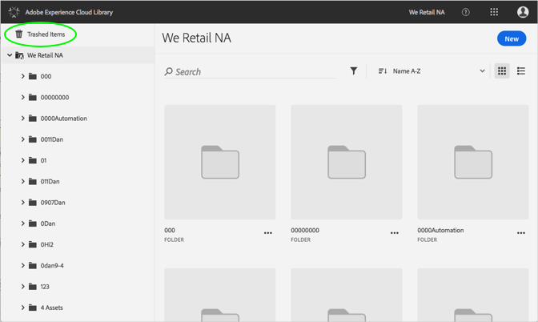
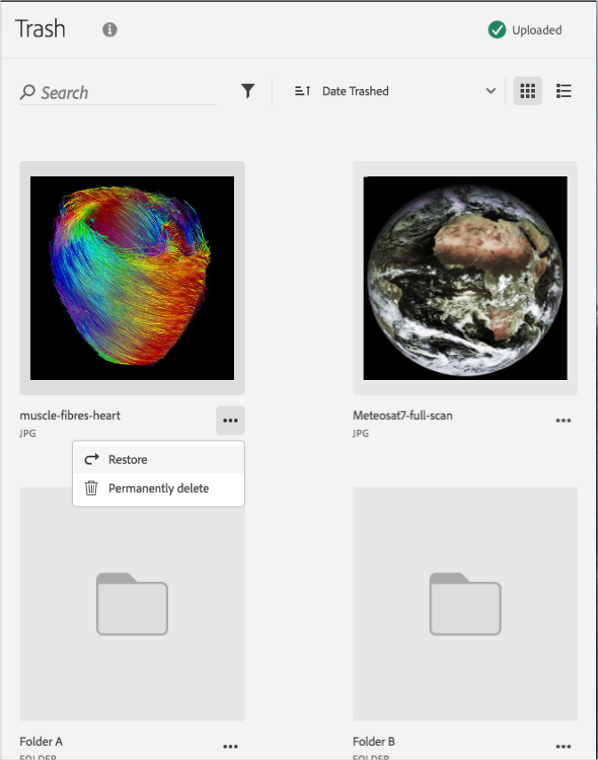

# Een verouderd element permanent verwijderen{#permanently-delete-a-trashed-asset}

U kunt een getrapt element permanent verwijderen uit de Adobe Experience Cloud-bibliotheek.

Wanneer u een item in de prullenbak prullenmand opslaat, woont het 60 dagen in het gebied Verlopen items in de Experience Cloud Library. Als u items niet herstelt, verwijdert Experience Cloud Library deze na 60 dagen definitief.

U kunt een neergezet element binnen 60 dagen definitief verwijderen door:

1. Klik op **[!UICONTROL Trashed Items]**.

   

1. Klik op een of meer items om deze permanent te verwijderen.
1. Klik op **[!UICONTROL More Info > Permanently delete]**.

   

1. Bevestig dat u de geselecteerde elementen permanent wilt verwijderen.

