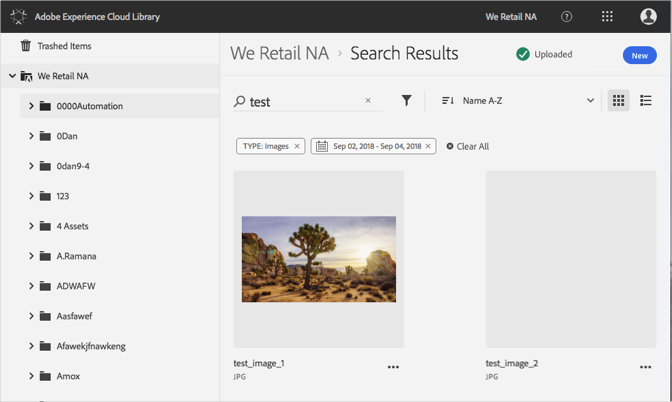

# Zoeken naar elementen{#search-for-assets}

Zoek naar elementen in de Adobe Experience Cloud-bibliotheek om middelen in de hele organisatie of in een specifieke map te zoeken.

Gebruik de zoekbalk om te zoeken naar elementen in de Experience Cloud Library. De zoekopdracht doorzoekt de bestandsnamen.

