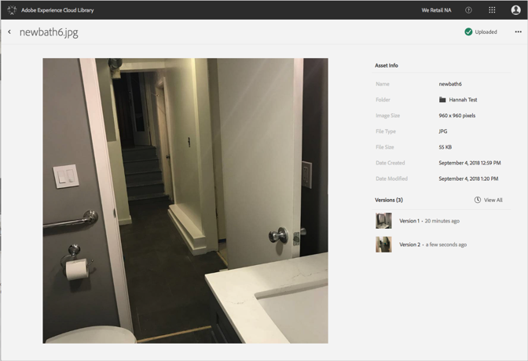

# Gedetailleerde informatie voor een element weergeven{#view-detailed-information-for-an-asset}

Bekijk gedetailleerde informatie over elementen, waaronder versies, in de Adobe Experience Cloud-bibliotheek.

Gedetailleerde informatie over elementen, waaronder versies, weergeven in de Experience Cloud-bibliotheek:

1. Klik op een element.
1. Klik op de knop **[!UICONTROL More Options]** menu (ovaal) naast het element.

   

1. Klikken **[!UICONTROL View Details]** voor meer informatie over een element.

   

