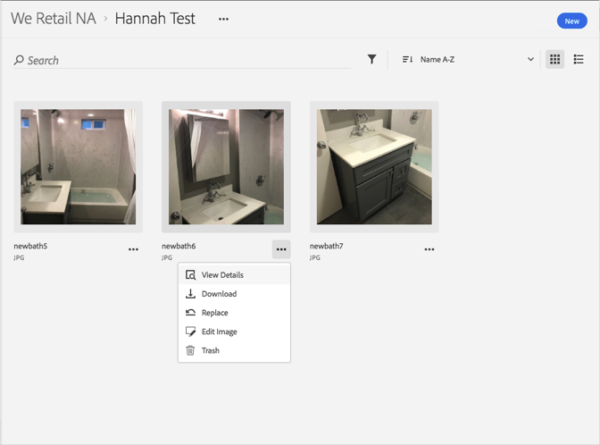

# Een element vervangen{#replace-an-asset}

U kunt middelen vervangen in de Adobe Experience Cloud-bibliotheek.

Een element in de Experience Cloud-bibliotheek vervangen:

1. Klik op een element.
1. Klik op het **[!UICONTROL More Options]** menu (ellips) naast het element.

   

1. Klik op **[!UICONTROL Replace]**.
1. Selecteer het nieuwe element dat u wilt vervangen.

