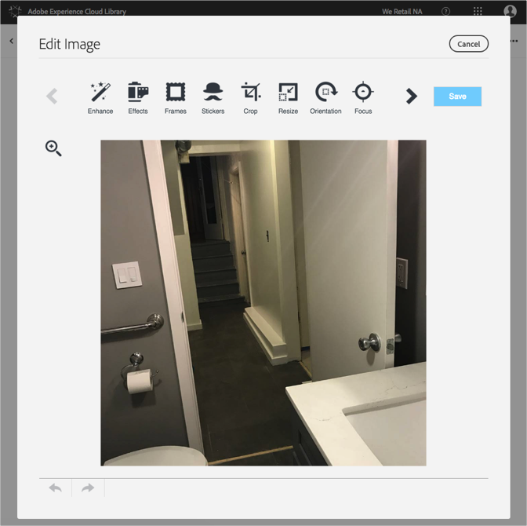

# Een afbeelding bewerken{#edit-an-image}

Gebruik de basisafbeeldingseditor die in de Adobe Experience Cloud-bibliotheek is ingebouwd om een afbeelding direct vanuit de bibliotheek te bewerken.

Een afbeelding bewerken in de Experience Cloud-bibliotheek:

1. Klik op een afbeelding die u wilt bewerken.
1. Klik op Afbeelding bewerken. Wanneer u de afbeelding opslaat, wordt deze opgeslagen als een nieuwe versie.

   De afbeeldingseditor wordt geopend en u kunt de afbeelding bewerken.

   

