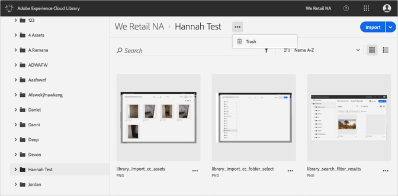
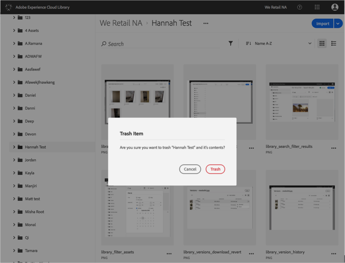

# Een map naar de prullenmand verplaatsen{#trash-a-folder}

U kunt een map in de Adobe Experience Cloud-bibliotheek naar de prullenbak verplaatsen.

Een map in de Experience Cloud-bibliotheek als afval opslaan:

1. Klik op de map die u als prullenbak wilt gebruiken.
1. Klik op de **[!UICONTROL More Options Menu]** (ellips) en selecteer **[!UICONTROL Trash]**.

   

1. Bevestig dat u de map wilt verwijderen.

   

