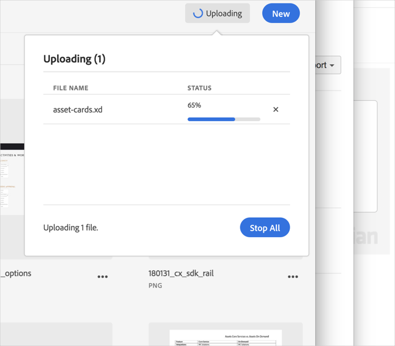

# Uploaden annuleren{#cancel-an-upload}

Annuleer het uploaden van uw apparaat naar de Adobe Experience Cloud-bibliotheek als u het onjuiste of te grote bestand hebt geselecteerd.

Een reeds begonnen upload annuleren:

1. Klik op de meldingsindicator.
1. Klikken **[!UICONTROL Stop All]** om alle downloads te stoppen of klik op de knop **[!UICONTROL X]** naast afzonderlijke bestanden om te annuleren.

   

Als u een of meer bestanden met dezelfde naam selecteert, wordt u in de Experience Cloud-bibliotheek gevraagd de oude versies te vervangen of de nieuwe versies te behouden.
