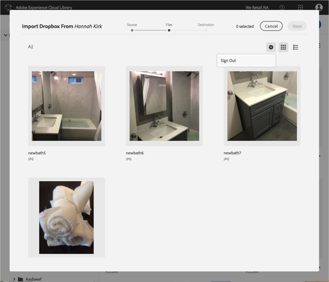

# Dropbox- of Creative Cloud-accounts wijzigen{#change-dropbox-or-creative-cloud-accounts}

Schakel over naar een ander Dropbox- of Creative Cloud-account om inhoud toe te voegen aan de Adobe Experience Cloud-bibliotheek.

Als u zich eenmaal hebt aangemeld bij een Dropbox- of Creative Cloud-account, blijft u aangemeld, tenzij u zich afmeldt of van account verandert.

Ga als volgt over naar een andere Dropbox- of Creative Cloud-account:

1. Selecteer **[!UICONTROL New]** > **[!UICONTROL Import]**.

   

1. Selecteren **[!UICONTROL Creative Cloud]** of **[!UICONTROL Dropbox]**.

   

1. Selecteer **[!UICONTROL Next]**.
1. Selecteer het tandwielpictogram in de rechterbovenhoek.

   

1. Selecteer **[!UICONTROL Sign out]**.
1. Meld u aan bij de andere account.

