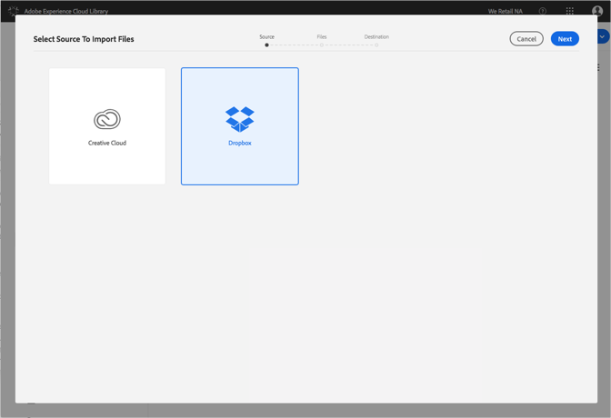
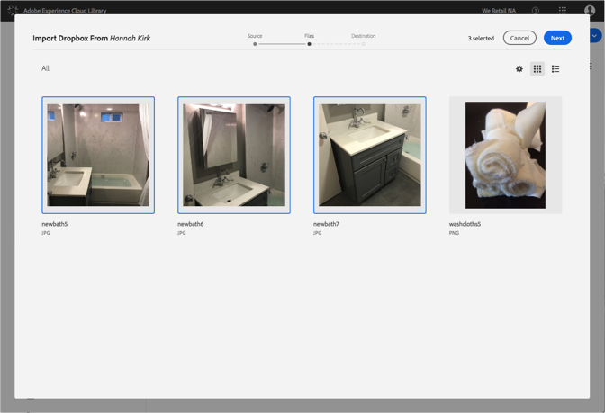
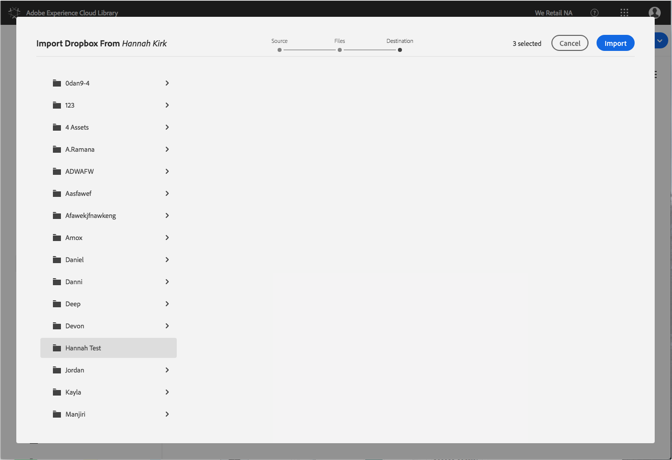

# Dropbox-bestanden importeren in de Adobe Experience Cloud-bibliotheek{#import-dropbox-files-into-the-adobe-experience-cloud-library}

Importeer bestanden van Dropbox naar de Adobe Experience Cloud-bibliotheek om deze te beheren vanuit elk Adobe Experience Cloud-product.

>[!NOTE]
>
>U moet een map maken voordat u deze taak kunt uitvoeren.

Dropbox-bestanden importeren in de Experience Cloud-bibliotheek:

1. Selecteer **[!UICONTROL New]** > **[!UICONTROL Import]**.

   

1. Selecteer **[!UICONTROL Dropbox]**.

   Meld u aan bij uw Dropbox-account, als u dat nog niet hebt gedaan.

   

1. Klik op **[!UICONTROL Next]**.
1. Selecteer een of meer bestanden die u wilt importeren.

   

1. Klik op **[!UICONTROL Next]**.
1. Selecteer de map waarin u de elementen wilt plaatsen.

   >[!NOTE]
   >
   >U kunt één map kiezen waarin u de elementen wilt importeren. Als u bestanden in verschillende mappen wilt plaatsen, herhaalt u deze taak voor elke map.

   

1. Klik op **[!UICONTROL Import]**.

