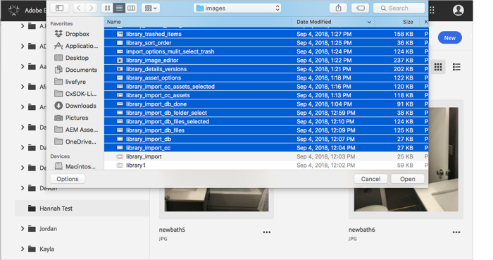
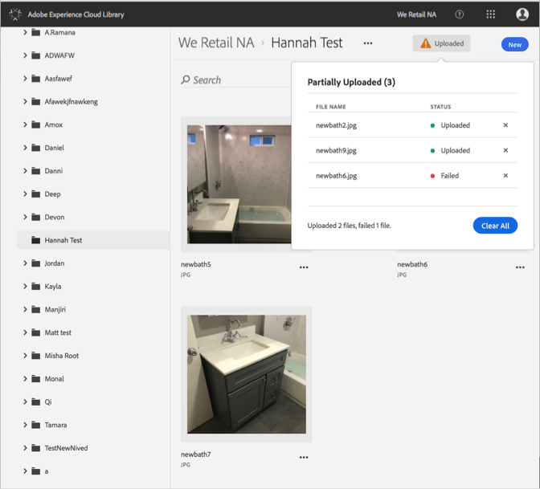

# Element uploaden vanaf apparaat{#upload-asset-from-device}

Upload elementen van uw apparaat om deze te beheren in de Adobe Experience Cloud-bibliotheek.

Elementen van uw apparaat naar de Experience Cloud-bibliotheek uploaden:

1. Selecteer **[!UICONTROL New]** > **[!UICONTROL Upload]**.

   

1. Selecteer de elementen die u wilt uploaden naar de Experience Cloud-bibliotheek.

   

1. Wanneer uw bestanden zijn geüpload, wordt een bevestiging of foutbericht weergegeven in het berichtvenster.

   

